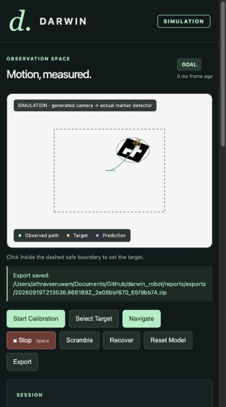
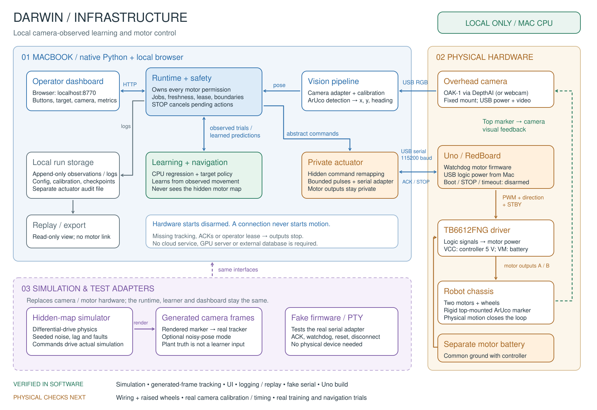

# Darwin

**A two-wheel robot that learns how its own body moves—and relearns when that body changes.**

Darwin receives two abstract motor commands, watches the result through an overhead camera, and learns the relationship between command and motion from scratch. If its wheels are later swapped, reversed, or weakened, Darwin is not told what changed. It notices that its predictions no longer match what the camera sees, stops, chooses new experiments, refits its model, validates the replacement, and continues toward the original target.

Everything in the control loop runs locally on CPU. The learner never receives the hidden actuator map, wheel truth, or simulator state.



## Why Darwin exists

Most robots depend on a fixed calibration supplied by a human. That calibration quietly becomes wrong when wiring changes, a motor weakens, or the robot is rebuilt. Darwin treats its own model as a hypothesis that must keep agreeing with observation.

The overhead camera gives the robot a third-person view of itself:

```text
requested motor command
          │
          ▼
   predicted motion ─────┐
                         ├── prediction error ──► detect change
   camera observation ───┘                         │
                                                  ▼
                                    design experiments, relearn,
                                    validate, and resume navigation
```

This is a closed self-supervised learning loop: the camera supplies labels, held-out trials decide whether a model is usable, and persistent prediction error decides when learning must begin again.

## What it does

1. **Explore:** execute 24 bounded motor pulses selected to cover the two-command action space.
2. **Observe:** track an ArUco marker and convert camera pixels into position and heading.
3. **Learn:** fit an affine ridge model from `[left command, right command, bias]` to `[forward velocity, yaw rate]`.
4. **Validate:** score the model on 12 independent held-out pulses. Training and held-out action IDs are required to be disjoint.
5. **Navigate:** search candidate commands with the learned model while enforcing arena, footprint, obstacle, time, and action limits.
6. **Detect drift:** compare predicted motion with measured motion. A single noisy pulse cannot trigger recovery; the error must persist.
7. **Recover:** freeze the stale model, choose informative new experiments, fit an adapted model, compare both models on the same fresh held-out set, and resume the interrupted route.

The dashboard exposes the real runtime state: camera observations, requested commands, model error, uncertainty, frozen and adapted predictions, safety state, route, and append-only event history. Simulation is always labelled as simulation.

## Results

Darwin has been exercised in simulation and on the physical Arduino/OAK-camera stack.

| Evidence | Result |
|---|---:|
| Multi-seed simulation benchmark | 45 mutation cases, no workflow errors |
| Navigation before mutation | 180 / 180 targets |
| Navigation with stale model | 5 / 180 targets |
| Navigation after relearning | 180 / 180 targets |
| Prediction-error reduction after adaptation | 89.95% minimum, 97.73% mean |
| Rendered-camera demo | 4/4 before, 0/4 stale, 4/4 adapted |
| Synthetic vision | 150/150 frames; 0.946 mm position RMSE |
| Physical learned navigation | target reached in 10 actions, final error 5.71 cm |

The physical run also recorded 177 actions and 175 camera-measured transitions. Physical operation remains supervised: camera disconnect behavior, stopping distance, battery behavior, and every new mechanical arrangement must be checked before a moving run.

See [STATUS.md](STATUS.md) for the current hardware state and [reports/EVIDENCE.md](reports/EVIDENCE.md) for the original hardware-independent acceptance evidence.

## Architecture



The same runtime, model, controller, safety state machine, recorder, replay engine, and dashboard run in simulation and hardware. Only two adapters change:

| Layer | Simulation | Hardware |
|---|---|---|
| Observation | Generated camera frame through the real ArUco tracker | OAK camera, webcam, or recorded video |
| Actuation | Hidden-map differential-drive plant | USB serial to Arduino Uno firmware |

Core components:

- **Vision:** calibrated homography, ArUco pose tracking, stale-frame detection, optional camera-derived obstacles.
- **Learning:** small interpretable ridge model, rank checks, held-out gates, change detection, active experiment selection, versioned JSON checkpoints.
- **Control:** learned-model candidate search with swept-footprint boundary and obstacle checks.
- **Safety:** disarmed startup, one-tab operator lease, continuous tracking and transport checks, cancellation, bounded pulses, serial acknowledgements, and an independent firmware watchdog.
- **Evidence:** immutable JSONL observations, actions, transitions, events, evaluations, exports, and a separate privileged actuator audit.
- **Interface:** local FastAPI dashboard with Arena and Observatory views; no cloud service is required.

The hidden mapping exists only inside the simulation plant or physical actuator. The learner receives requested actions and camera-measured motion only.

## Run the simulation

Darwin requires Python 3.11 or newer. Do not copy a virtual environment between computers.

### macOS or Linux

```bash
git clone https://github.com/athravseruwam07/darwin.git
cd darwin
python3 -m venv venv
venv/bin/python -m pip install --upgrade pip
venv/bin/python -m pip install -r requirements.resolved.txt
venv/bin/python -m pip install -e '.[dev]'
venv/bin/python -m darwin.cli doctor
venv/bin/python -m darwin.cli demo --mode simulation --config configs/simulation.yaml --ui-port 8770
```

### Windows PowerShell

```powershell
git clone https://github.com/athravseruwam07/darwin.git
cd darwin
py -3.13 -m venv venv
.\venv\Scripts\python.exe -m pip install --upgrade pip
.\venv\Scripts\python.exe -m pip install -r requirements.resolved.txt
.\venv\Scripts\python.exe -m pip install -e ".[dev]"
.\venv\Scripts\python.exe -m darwin.cli doctor
.\venv\Scripts\python.exe -m darwin.cli demo --mode simulation --config configs\simulation.yaml --ui-port 8770
```

Open the URL printed by the CLI. Darwin uses `http://127.0.0.1:8770` by default and selects the next free local port if necessary.

### Demo walkthrough

1. Press **Start Calibration** and wait for the training and held-out probes to finish.
2. Press **Select Target**, click inside the dashed safe arena, then press **Navigate**.
3. Choose a mutation such as reverse left, reverse right, reverse both, swap wheels, weaken left, or a random admissible combination.
4. During navigation, press **Inject Mutation**. The hidden change is applied at the next safe boundary between motor pulses.
5. Watch the measured residual cross the detection threshold, the robot stop, collect recovery experiments, validate the adapted model against the frozen model, and resume the original goal.
6. Open **Observatory** to inspect the learned command-to-motion surface, camera observations, motor-influence graph, held-out errors, and adaptation timeline.

**Full Adaptation Challenge** runs the same sequence as a one-button demo. **Draw Route** accepts two or more waypoints.

## Optional narration

Darwin can narrate its measured state in a small first-person panel. The deterministic narration works without external services. OpenAI can optionally rephrase the fact-backed sentence and ElevenLabs can speak it.

```dotenv
# .env
OPENAI_API_KEY=...
ELEVENLABS_API_KEY=...
```

Set `OPENAI_API_KEY` and/or `ELEVENLABS_API_KEY`. `.env` is ignored by Git, environment variables take precedence, and the CLI reports only whether keys are present. `--no-brain` and `--no-voice` disable these features.

Narration is isolated from control: it runs on a separate worker, never holds the runtime lock, and has no path to a motor command. A rewrite is rejected if it introduces a number unsupported by the runtime facts.

## Hardware

The reference robot uses:

- Arduino Uno R3
- TB6612FNG dual motor driver
- two DC gear motors
- independent motor battery connected to driver `VM`
- overhead OAK camera and ArUco marker
- Mac or Windows computer connected to the Uno over USB

The firmware pin map is:

| Arduino | TB6612FNG |
|---:|---|
| D4 | AIN1 / AI1 |
| D7 | AIN2 / AI2 |
| D5 | PWMA |
| D8 | BIN1 / BI1 |
| D9 | BIN2 / BI2 |
| D6 | PWMB |
| D10 | STBY |
| 5V | VCC |
| GND | shared GND |

Motor-battery positive goes to `VM`; battery negative, driver ground, and Arduino ground share a common ground. The motors must not be powered from the Arduino 5 V pin.

Read [firmware/REVIEW.md](firmware/REVIEW.md) before connecting hardware. Nothing in this repository automatically flashes the board or starts physical movement.

Create a machine-specific configuration:

```powershell
Copy-Item configs\hardware.example.yaml configs\hardware.local.yaml
.\venv\Scripts\python.exe -m darwin.cli doctor
.\venv\Scripts\python.exe -m darwin.cli motor-test --port COM_ACTUAL
.\venv\Scripts\python.exe -m darwin.cli calibrate --config configs\hardware.local.yaml --ui-port 8772
```

The first motor test performs a handshake and leaves the controller disarmed. Any moving pulse requires raised wheels and an explicit confirmation flag:

```powershell
.\venv\Scripts\python.exe -m darwin.cli motor-test --port COM_ACTUAL --channel A --pwm 30 --pulse-ms 80 --raised-wheel-confirmed
.\venv\Scripts\python.exe -m darwin.cli motor-test --port COM_ACTUAL --channel B --pwm 30 --pulse-ms 80 --raised-wheel-confirmed
```

Before floor motion, verify wheel polarity, physical STOP, host-loss watchdog, reconnect-disarmed behavior, power stability, camera-loss stopping, marker tracking, footprint, camera age and jitter, PWM dead zone, settling, coast, and stopping clearance. Hardware mode starts disarmed:

```powershell
.\venv\Scripts\python.exe -m darwin.cli demo --mode hardware --config configs\hardware.local.yaml --ui-port 8770
```

## Verification

Run the portable software checks:

```bash
venv/bin/python -m pytest -q
venv/bin/python -m darwin.cli vision-test --synthetic --output reports/vision
venv/bin/python -m darwin.cli protocol-test --fake
venv/bin/python -m darwin.cli simulate --seed 42 --output reports/sim_42
venv/bin/python -m darwin.cli benchmark --observation pose --seeds 11,22,33 --variants linear,noisy,nonlinear --output reports/benchmark
```

On Windows, replace `venv/bin/python` with `.\venv\Scripts\python.exe`. The complete verifier is:

```bash
venv/bin/python scripts/verify_without_hardware.py
```

Synthetic vision generates pixels and sends them through the actual ArUco detector. The benchmark uses pose observations for speed, covers five actuator changes across three plant variants, and retains failures in the denominator.

## Replay and export

Every run is recorded for inspection without reopening a camera or serial port:

```bash
venv/bin/python -m darwin.cli export --run data/runs/RUN_ID --output reports/exports
venv/bin/python -m darwin.cli replay --run data/runs/RUN_ID --ui-port 8771
```

Replay is read-only and never constructs a live actuator. Checkpoints are non-executable JSON rather than pickle files.

## Project map

```text
src/darwin/
  cognition/     fact-backed optional narration
  control/       exploration, learned navigation, routes
  io/            camera, serial, fake firmware, video adapters
  learning/      model, drift detector, active experiments, memory
  recording/     append-only logs, export, replay
  simulation/    hidden-map differential-drive plant
  vision/        calibration, tracking, obstacle geometry
  web/           local API and dashboard
firmware/        Uno firmware, host harness, review notes
configs/         simulation and safe hardware templates
tests/           learning, safety, vision, serial, UI, replay
reports/         measured evidence and benchmark artifacts
```

## Scope

Darwin demonstrates recovery from controlled actuator remapping and gain changes. It does not claim to diagnose arbitrary mechanical damage, improve its own learning algorithm, or make an LLM part of the motor-control loop. Physical results and simulation results are reported separately.

The infrastructure diagram is also available as an editable [Excalidraw file](docs/diagrams/darwin-infrastructure.excalidraw).
